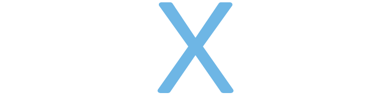
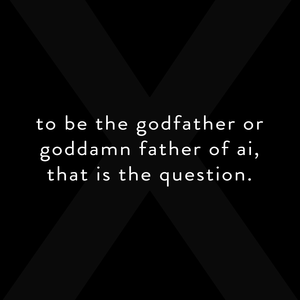

<head>
  <link rel="icon" href="assets/favicon.ico" type="image/x-icon">
  <!-- Google tag (gtag.js) -->
  
  
</head>

# MindWave X, Inc 

## Our Business
We make a device that transcribes conversations into time-stamped and speaker-annotated notes with summaries.

### Vision
At MindWave, we seek to build an approach to understand the most intuitive and direct reflection of human intelligence, speech and conversations.

By providing Hardware as a Service, we will act as the upstream of human-internet interface that not only enhance your communication skills but also provide unprecedented add-on values to access, interact and understand information.

From augmented intelligence, to artificial intelligence, MindWave will transform the world to rethink about data, device and intelligence.

### Problem
- Information Overload
    - Audios are easy to record but hard to review 
    - Taking notes is distractive
- Fear of A.I. Overlord
    - Human should be first
    - Human is still more intelligent
    - A.I. should enhance human intelligence

### Our solutions
- Intelligent meeting note taker It detects speech
    - It transcribes conversations
    - It summarizes the meeting minutes

<video controls width="640" height="360">
  <source src="assets/MindWave Demo.mp4" type="video/mp4">
  Your browser does not support the video tag.
</video>

## Latest Status

- 2019-03: [Domi](https://domij.info/) ceased all business activities to learn how to build a sustainable startup.
- 2019 - 2022: I worked at a pre-seed B2C consumer startup as full-stack data scientist, to learn about the engineering stack, business and execution. We almost raised series B. 
-  2022-2023: I worked at a pre-seed full-remote startup as applied scientist, to learn about marketplace & pricing. I practiced leading new innovative initiative and leadership. Failed. 
- 2023-2024: I helped my friends with only B2B corporate experience raise over $2M for a B2C startup. Served as advisor, while working full time at an IPO $startup$ in the research scientist team. Learning about the lean culture and large-scale performance advertising ad delivery system. 
- 2024-11: I started a [substack](https://domijin.substack.com) about my new attempt to realize the vision. 
- 2024-12: [Kin Domi](kindomi.net) was officially incorporated to carry out the vision with a focus on mental wellbeing for seniors. 
